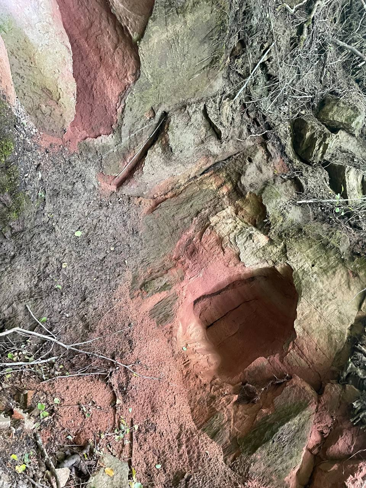
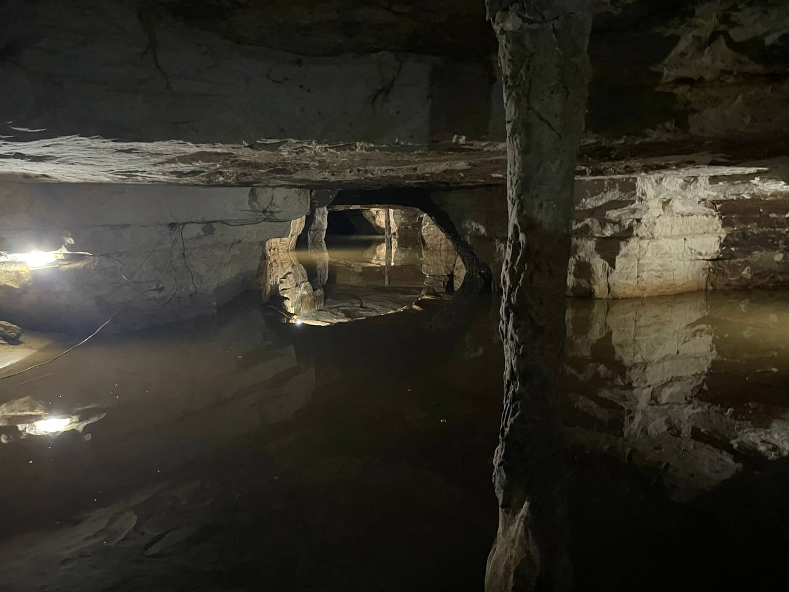
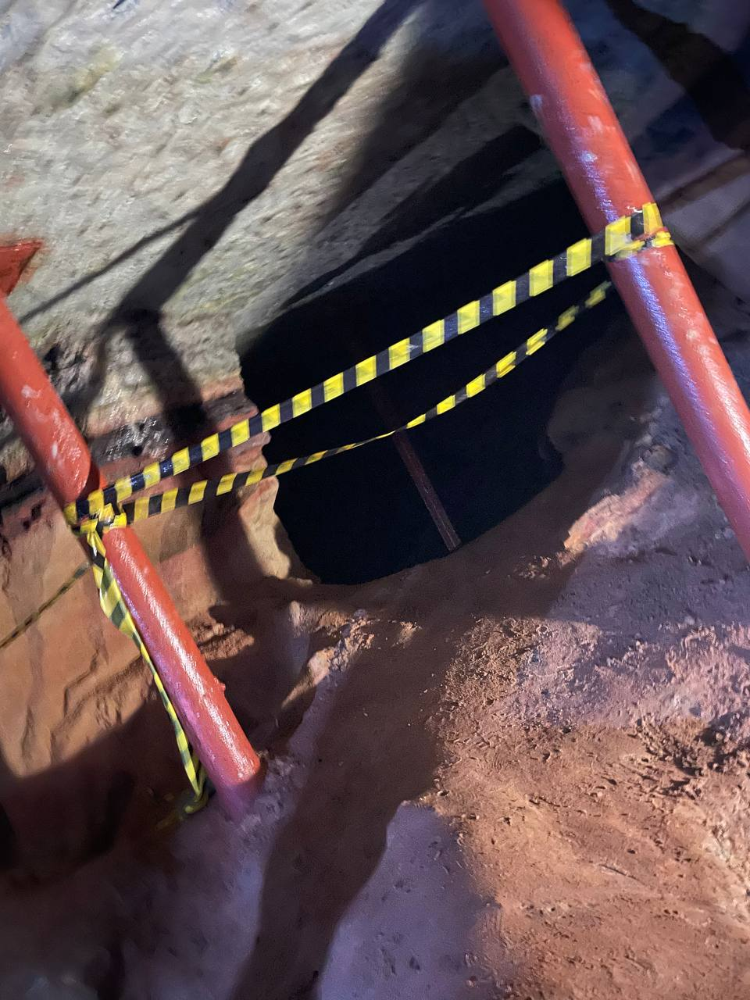
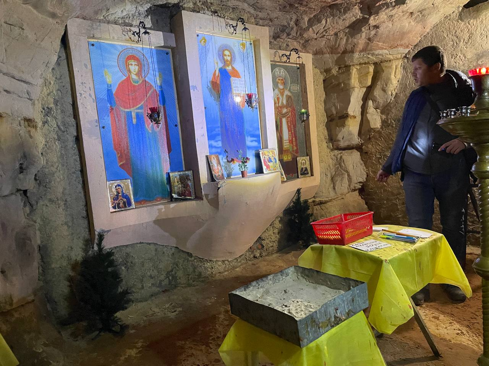
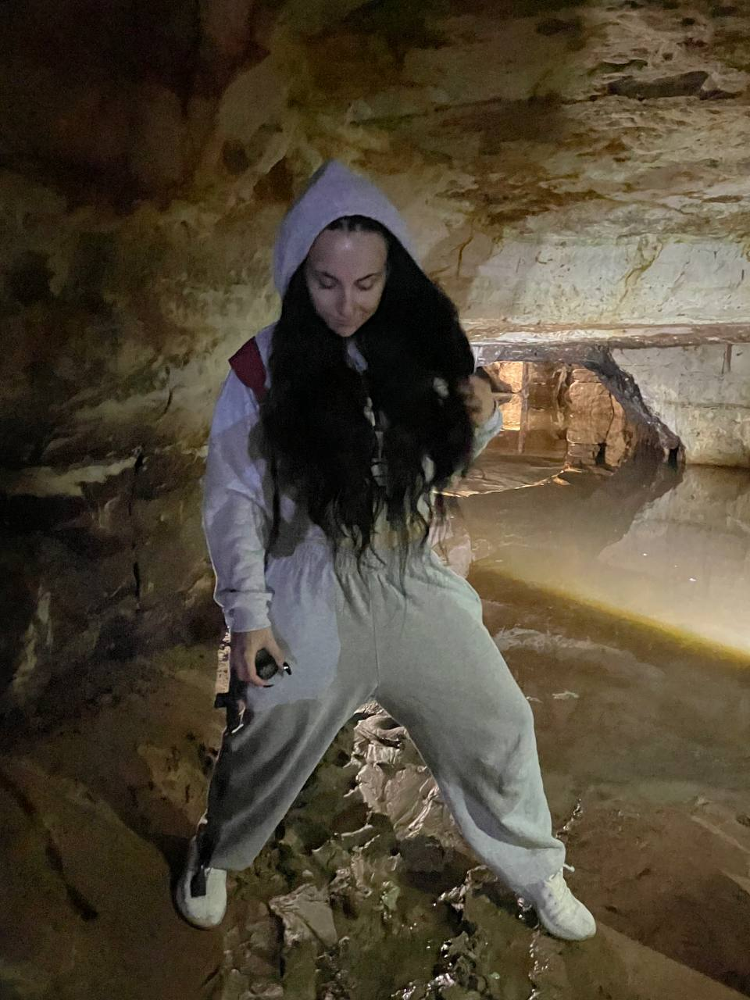
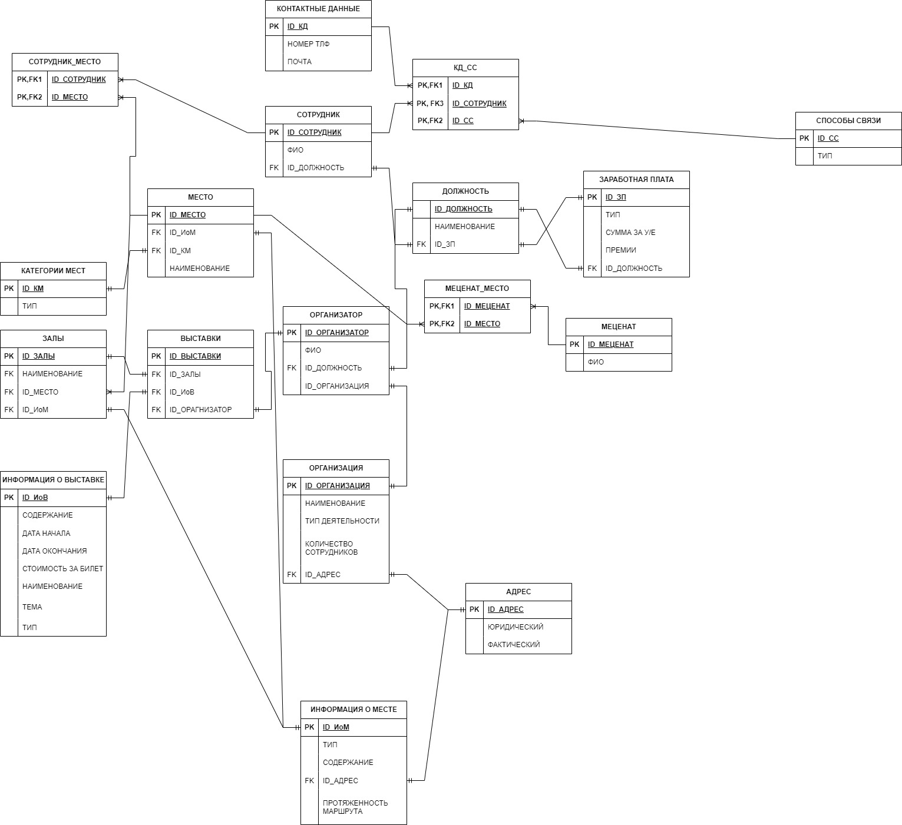

# Задача "Сформировать структуру базы данных для музея"

- [x] Посетить любой музей в вашем городе. Сделать фотоотчет (фото музея, себя на фоне музея/внутри музея)  
- [ ] Составить в экселе базу данных со следующей структурой: название таблиц, название полей, название параметров, описание полей, описание параметров.
- [ ] База данных должна включать не менее 30 таблиц!  
- [x]  Нарисовать взаимосвязи таблиц (miro/draw.io/excel).  
- [x]  Написать сценарий использования созданной базы данных.

## Описание решения задачи
В рамках выполнения домашнего задания и для модуля "База данных в музее" был посещен так называемый природный комплекс "Саблино", куда входит "Саблинский водопад", "Тосненский водопад" и "Саблинские пещеры".  

### Фотоотчет
 
 
 
 
 

В ходе написания структуры таблиц и их взаимосвзей было принято решение не делать 30 таблиц, т.к. а этом просто не было смысла и база данных получилась бы не связная и толку от нее было бы (кроме глобализации) - нуль.

## Сценарий использвания базы данных

Данная база данных расчитана на то, чтобы отслеживать какие сотрудники за какую часть отвечают (экскурсии, запись на них), а так же, какие выставки и в каком месте можно было бы сделать + отслеживаются меценаты

- Схема взаимосвязей прикреплена файлом 